# Markoarchitektur

Das folgende Kapitel beschäftigt sich mit Markoarchitektur, Microservices, Programmiermustern und Frontendentwicklung, im Zuge der Anbindung an eine einer REST-API, anhand eines Bestellmanagements.

- [Markoarchitektur](#markoarchitektur)
  - [Was ist Makroarchitektur](#was-ist-makroarchitektur)
  - [Ports and Adapters](#ports-and-adapters)
  - [Architekturanalyse - Ausgangsprojekt erplite](#architekturanalyse---ausgangsprojekt-erplite)
    - [Ordermanagement](#ordermanagement)
    - [Stockmanagement](#stockmanagement)
    - [REST-API und Events](#rest-api-und-events)
  - [Frontend - Umsetzung mittels Svelte](#frontend---umsetzung-mittels-svelte)
    - [Vorbereitung](#vorbereitung)
    - [Umsetzung](#umsetzung)
  - [Microservices](#microservices)
    - [Architekturanalyse - erweiterte Implementierung](#architekturanalyse---erweiterte-implementierung)
    - [Allgemeiner Aufbau](#allgemeiner-aufbau)
      - [API-Gateway](#api-gateway)
      - [Service Discovery](#service-discovery)
    - [Vorgänge](#vorgänge)
    - [Inbetriebnahme des Projekts](#inbetriebnahme-des-projekts)
      - [Ablauf](#ablauf)
    - [Fazit](#fazit)

## Was ist Makroarchitektur

Während sich Mikroarchitektur auf den "vertikalen" Aufbau, also das innere Programmdesign (zB Technologien, Designpatterns) konzentriert, definiert die Makroarchitektur Regeln für die Kommunikation einzelner Microservices.

(https://ricofritzsche.de/mikro-und-makroarchitektur)

Fachvokabular:
 - Makroaritektur
 - Microservices
 - Monolith
 - Modulith
 - Event-Driven-Design
 - Domain-Driven-Design
 - Events
 - Domain
 - Value Objects
 - Aggregate
 - Clean-Architecture
 - Ports (Input/Output)
 - Adapters
 - Shared Kernel

## Ports and Adapters

Ist das Basismuster der **Clean-Architecture**

Clean-Architecture:
 - Unabhängigkeit der Infrastruktur (einfache Austauschbarkeit zB von Technologien)
 - Ziel ist die **Flexibilität** (immer nicht funktionale Anforderungen)
 - Zielt weiters auf die **Wiederverwendung** ab
 - Beschleunigt den Enticklungsprozess &rarr; verringert Time-to-Market (benötigte Zeit um Softwareprodukt komplett fertigzustellen)
 - fordert daher einen konkreten Lösungsweg: eine Anwendungsarchitektur<br>
&rarr; Realisierung mithilfe von **Schnittstellen**

**Ports and Adapters** liefert einen einheitlicheen Weg: Trennen von Infrastruktur und Domäne mit Adaptern, welche die Schnittstellen realisieren

Aufbau:
- Domäne: Use-Case (Interfaces, Service-Layer) und Entity
- Adapter: implementiert eine Schittstelle zB ein Repository oder Controller
- Infrastruktur: zB Datenbank, Web-Frontend

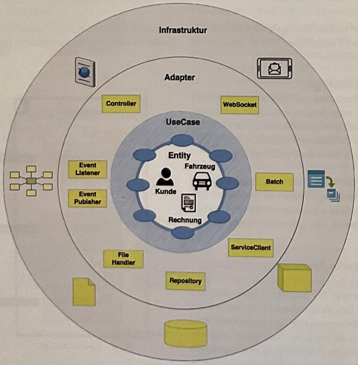
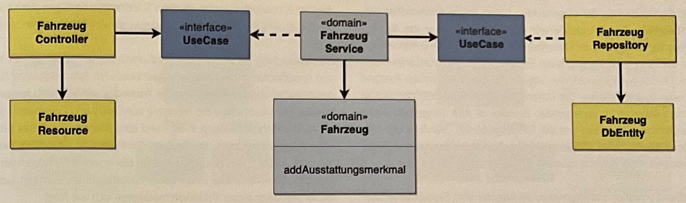
© Matthias Eschhold - Novatec Consulting GmbH

*Grundprinzip: unabhängige Domänen*

Grundsätze (zur Erreichnung):
- Dependency Inversion (Abhängigkeit von Abstraktionen)
- Dependency Injection (Adapter Erzeugung auslagern) - die Domäne kennt nur den Use-Case

(https://de.wikipedia.org/wiki/Dependency-Inversion-Prinzip, https://de.wikipedia.org/wiki/Dependency_Injection)

Anbindung an Business-Logik funkioniert über Schnittstellen, die **Ports** (ist immer ein *Interface*) &rarr; ein Port bildet also eine Kommunikationsschnittstelle
Man unterscheidet:
- Input (Primary) Ports - Von innen implementiert, von außen verwendet zB Controller verwendet Service (Interface)
- Output (Secondary) Ports - Von außen implementiert, von innen verwendet zB Service verwendet Repository (Interface) - Datenbank ist von meiner Schnittstelle abhängig (Dependency Inversion)

## Architekturanalyse - Ausgangsprojekt erplite

Es handelt sich hierbei um ein Spring Boots Projekt, welches als **Monolith** (eine zusammenhängende Einheit) bzw. als **Modulith** (als Deployment-Monolith verstanden) umgesetzt wurde.  

(https://entwickler.de/software-architektur/microservices-oder-monolithen-beides)

Aufgeteilt in:
 - Ordermanagement
 - Stockmanagement
 - Customermanagement

Beleuchtet werden das Order- und Stockmanagement in Bezug auf den folgenden Ablauf:
*Artikel bestellen und Bestellstatus ändern (bezahlt, verpackt, verschickt)*

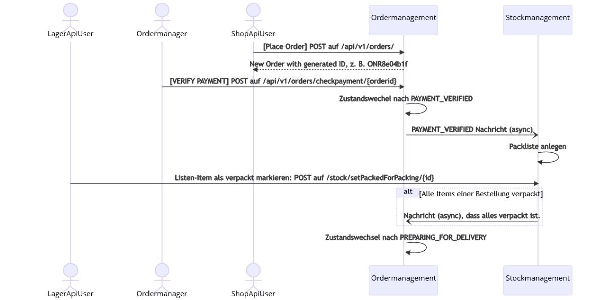
© Tobias Antensteiner

Allgemeiner Aufbau:
 - MVC (Model-View-Controller) Pattern
 - Kommunikation von außen mittels REST-API über HTTP-Methoden POST und GET (REST-Controller Implementierung als Schnittstellte)

### Ordermanagement

Ordermanagement Aufbau:
 - Grundstruktur mittels Ports And Adapters Pattern
 - Ereignisgesteuert (**Event-Driven**)
   - Kommunikation zwischen den Modulen wedren durch Ereignisse/Events gesteuert - bildet die einige Schnittstelle untereinander
   - verbessert die Kopplung dahingehend, da Events von einer unabhängigen Stelle "blind" ausgeführt werden (Komponente A kennt neben der Implementierung auch nicht die Signaturen und damit die Funktionalitäten der Komponente B bzw. deren Schnittstelle)
   - Events werden über die Ports abgewickelt
   - Events (zB Controller, Repository) nutzen zentral festgelegte Commands und Queries
   - Intern umgesetzt mittels Spring Events
     - eigene Handler übernehmen Event Processing (über ApplicationListener asynchron zwischen Modulen und ApplicationEventPublisher synchron bei den Domain-eigenen Events)
 - Domänenorientiert (**Domain-Driven**)
   - Domänen verwenden um die Wiederverwendbarkeit zu gewährleisten sogenannte ValueObjects
   - **ValueObjects**: immutable/unveränderbare "Datenfelder" (keine Seiteneffekte) - umgesetzt mittels Java Records
   - **Aggregates**: fassen ValueObjects und Entitäten zusammen (definieren wie eine Unit)
 - Datenbank
   - Datenbankentität entspricht nicht der Domänenentität
   - bei Datenbankoperationen werden Daten gemappt (eigener Mapper Use Case)
 - **Shared Kernel**
   - enthält Daten die über die Schnittstelle ausgetauscht werden - diese müssen beide Aggregate kennen!
   - definiert (interne) Spring-Events, Queries, Commands (Wiederverwendbarkeit!)

Die Logik befindet sich fast komplett im Domänen und etwas im Service-Layer <br>
*Die Domäne bildet ein Businessobjekt ab*
&rarr; beispielsweise nicht das Datenbankentity, Infrastruktur != Domäne (Repositorys beziehen sich immer auf Aggregate)

(https://de.wikipedia.org/wiki/Ereignisgesteuerte_Architektur, https://de.wikipedia.org/wiki/Domain-driven_Design)

### Stockmanagement

 - kein Ports And Adapters Pattern, lediglich MVC Grundstruktur
   - auch ohne Service-Layer
   - keine Interfaces (Dependency Inversion)
 -  - Domain Events werden direkt ausgeführt (Klassenabhängigkeit)
 - Domäne entspricht der Datenbankentität
&rarr; keine Clean-Architecture und Abhängigkeiten in Bezug auf Technologien und Aufbauschichten

### REST-API und Events

Mithilfe der implementierten REST-Schnittstelle können die Funktionen genutzt werden.
Zum Testen wurde die Swagger-UI mit in das Spring Boot Projekt eingebunden, die eine Übersicht über alle Endpunkte bietet und über welche sich Abfragen absetzen lassen.

- Bestellung aufgeben
  - POST "/api/v1/orders"
  - `OrderPlacedEvent`
- Bestellung auf bezahlt (PAYMENT_VERIFIED) setzen
  - POST "/api/v1/orders/checkpayment/{orderid}"
  - `OrderPaymentValidatedSpringEvent`
- Packliste generieren
  - `StockIncomingMessageHandler` legt aufgrund des vorherigen Events eine Packliste an (im Stockmanagement)
- Packlistenitems abhaken
  - POST "stock/setPackedForPacking/{packingItemId}"
    ```java
    packingItem.setPacked(true); 
    packingItemRepository.save(packingItem);
    ```
- Bestellung auf IN_DELIVERY setzen wenn alle Packlistenitems gepackt sind
  -  `OrderIncomingMessagesAdapter` aktualisiert über das Event, sofern alle Items einer Order gepackt sind, den Order-Status (Ordermanagement)
  -  `OrderPackedSpringEvent`

## Frontend - Umsetzung mittels Svelte

Dieser Ablauf soll über ein Frontend gesteuert werden. Dieses ist mithilfe von Svelte, einem "schlanken", komponentenorientierten JavaScript Fremework, umgesetzt worden.

### Vorbereitung

```bash
#zu Beginn mus nodejs installiert werden
npm init vite@latest #neues Projekt erstellen mithilfe von vite
npm install --save svelte-navigator #für Routing
npm install
npm run dev
```

*(Routing: https://www.npmjs.com/package/svelte-navigator#installation)*

Um über das Frontend Requests abschicken zu können, muss dies (mittels Cross-Site-Scripting), da die Anfrage über eine andere Adresse bzw. über einen anderen Port kommt, an den benötigten Methoden (per Annotaion) im Controller erlaubt werden. 

```java
@CrossOrigin(origins = "http://localhost:3000/")
```

### Umsetzung

**Kunde**

Kundenansicht enthält einen Warenkorb mit Produkten die gekauft werden können

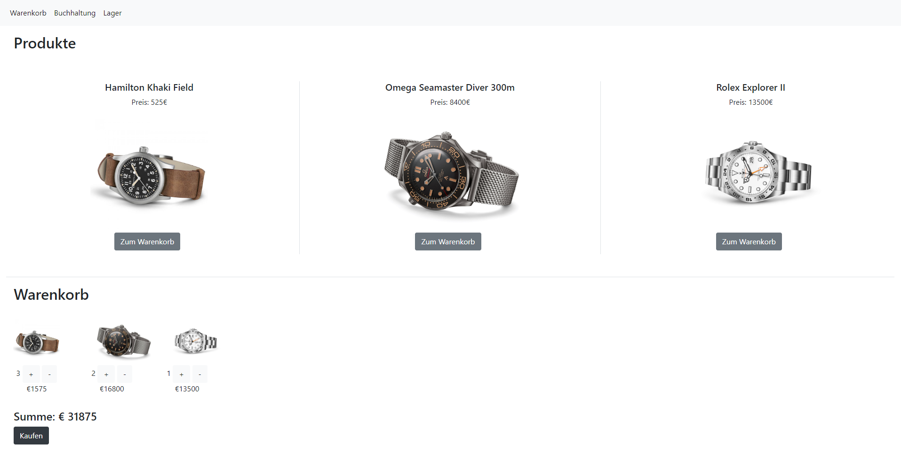

**Buchhaltung**

Die Buchhaltung kann manuell per Knopfdruck den Bestellstatus auf bezahlt setzen

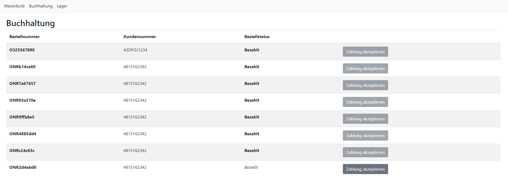

**Lager**

Im Lager werden die einzelnen Bestellpositionen angezeigt, deren Status auf verpackt gesetzt werden kann

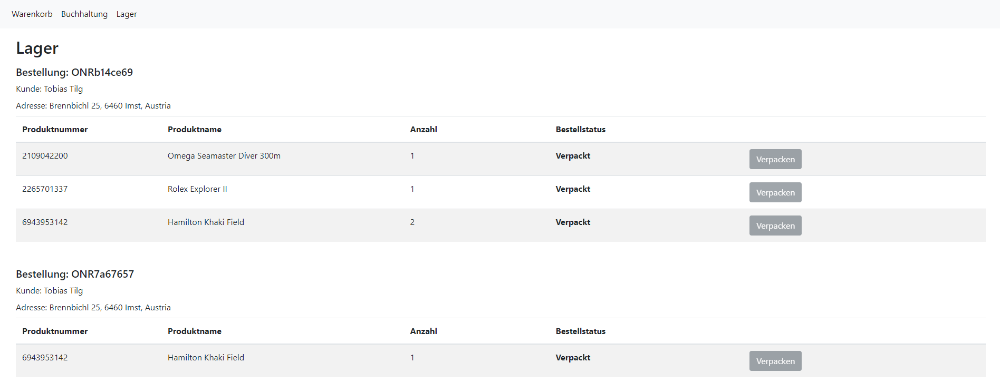

Eventuell erweitern:
 - alle Bestellungen anzeigen (neben Warenkorb)
 - Errorhandling
 - Codeausschnitte in Dokumentation

## Microservices

Bei dem architektonischen Ansatz Microservices zu verwenden, besteht gesamte Applikation aus einzelnen, voneinander unabhängigen Services die nur per API kommunizieren.

### Architekturanalyse - erweiterte Implementierung

Anhand des Beispiels des Bestellvorgangs, bildet das Order- und das Sockmanagement jeweils einen Microservice ab.

### Allgemeiner Aufbau

 - die Microservices sind im Grunde gleich designt wie in der vorherigen Version
   - Ordermanagement: Clean-Architekture, Ports-And-Adapters, Domänenorientiert
   - Stockmanagement: einfacher MVC Aufbau mit Repository
 - beide Mikroservices laufen in einem eigenen Java Runtime Container
 &rarr; es sind zwei eigene Applikationen
 - Kommunikation geschieht nun nicht mehr mit Spring Events, sondern zwischen den Services nur mehr per MessageBroker (RabbitMQ) - unabhängiger Dienst - und nach außen hin über die bereitgestellte REST-API der Services
 - jedes Microservice hat seine eigene Datenbank - sie bildet einen klaren Servicebestandteil ab (Implementierung und Datenbank sind eine Deployment-Einheit)

Das Beispiel nutzt aber auch zwei weitere Pattern, um die gewünschte Microservice-Architektur zu gewährleisten.

#### API-Gateway

Um nicht mehr direkt auf die verschiedenen Services zugreifen zu müssen wird ein API-Gateway verwendet
 - zentrale Schnittstelle/Einstiegspunkt alle Anfragen (von und zum Infrastruktur-Layer)
 - definiert Routen nach außen hin (in diesem Fall für Order- und Stockmanagement)
 - dadurch sind die einzelnen Services von außen nicht mehr Sichbar
 - könnte daher auch als Authentifizierungschnittstelle dienten (mittels Tokens und eigener Datenbank)
 - hier wäre auch der Einbau von Resilienzpattern, Fallbacks, usw. möglich (Ausfallsicherheit!)
 &rarr; zentralisiert also alle Anfragen an und von Services - Wiederverwandbarkeit!

Die Cors-Konfiguration ("Anfragen-Konfiguration") findet auch im API-Gateway statt - Ändeurngen können daudruch zur Laufzeit verändert werden und führen zu keiner Downtime

#### Service Discovery

Stellt grundsätzlich die Funktionalität für die Kommunikation bereit
 - sie dient einer Namensauflösung (ähnlich einem DNS) - Nameszuweisung für IP und Port eines Services &rarr; Abstraktion macht Verwendung in jedem beliebigen Netzwerk möglich
 - Load Balancer, innerhalb des API-Gateways, ermittelt die eigentliche Route - Service Discovery greift diese auf und löst dann Name und Adresse auf

Die Service Discovery und das API-Gateway sind maßgeblich für die Lauffähigkeit verantwortlich und düfen daher nie ausfallen - Redundanzen!

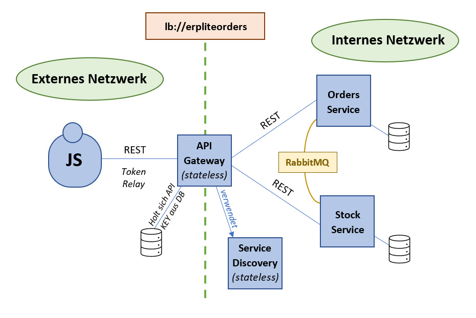
© Katharina Friedl

### Vorgänge

Jegliche REST Kommunikation von außen findet, wie bereits beschrieben, über das API-Gateway (localhost:9999) statt.

- Bestellung aufgeben
  - POST "/api/v1/orders"
  - Selbstdefiniertes `OrderPlacedEvent` wird vom `OutgoingRabbitMessageRelay` behandelt
- Bestellung auf bezahlt (PAYMENT_VERIFIED) setzen
  - POST "/api/v1/orders/checkpayment/{orderid}"
  - Selbstdefiniertes `OrderPaymentValidatedSpringEvent` wird vom `OutgoingRabbitMessageRelay` behandelt
- Packliste generieren
  - `StockIncomingRabbitMessageRelay` legt aufgrund des vorherigen Events eine Packliste an (im Stockmanagement)
- Packlistenitems abhaken
  - POST "stock/setPackedForPacking/{packingItemId}"
    ```java
    packingItem.setPacked(true); 
    packingItemRepository.save(packingItem);
    ```
- Bestellung auf IN_DELIVERY setzen wenn alle Packlistenitems gepackt sind
  -  Selbstdefiniertes `OrderPackedEvent` wird vom `StockMessagePublisher` behandelt
  -  `OrderIncomingMessagesAdapter` aktualisiert über das Event, sofern alle Items einer Order gepackt sind, den Order-Status (Ordermanagement)

### Inbetriebnahme des Projekts

Mithilfe von 3 Services, welche per Dockercontainer zu Verfügung gestellt werden, werden Teile der Infrastruktur vorgegeben.

 - MariaDB: Datenbank
 - phpmyadmin: Datenbankverwaltungstool
 - RabbitMQ: Messagebroker
   - Charakteristik: Warteschlage (Queue) die die Messages enthält
   - Messages können vorgehalten werden, bleiben so in der Queue gespeichert und werden nicht abgeholt

Weiters existiert noch ein einfaches JavaScript Frontend, das die API (über das API-Gateway) anzapft.

#### Ablauf

 1. Docker-Container starten
 2. Bei erstmaligem durchstarten sollten die von den Services definierten Datenbanken entweder manuell angelegt werden (oder man konfiguriert die Erstellung beim Start, falls noch nicht vorhanden) und gegebenenfalls alle Dependencys nochmal neu durchladen (pom.xml)
 3. Mirkoservices überprüfen und gegebenenfalls Konfigurationen anpassen
     -  Datenbankanbindung
     -  Messagebroker
     -  Service Discovery
        ```yml
        #IP-Adresse geändert, da Docker auf einer virtuellen Serverinstanz läuft
        spring.datasource.url=jdbc:mariadb://10.77.0.110:3306/stockmgmt
        spring.rabbitmq.host=10.77.0.110
        ```
  4. Cors-Konfiguration gegebenenfalls anpassen
     -  *Späterer Webserver für das Frontend läuft auf `localhost` mit Port 5500*
     -  Annahme: Auch wenn die Applikation nur eine bestimmte Adresse zulässt, heißt also nur von dieser Adresse aus darf eine Anfrage gesendet werden, kann der Webserver über alle definierten Adressen des Hostgeräts aufgerufen werden (liegt wahrscheinlich daran, dass Windows dies erkennt?)
        ```yml
        #IP-Adresse auf das ein selbst definiertes Host-Only Netzwerk geändert, damit alle Services und Dienste im selben Netwerk laufen  
        allowedOrigins: "http://10.77.0.254:5500"
        ```
  5. Spring Boot Applikationen starten, beginnend mit dem Service Discovery (für Namensauflösung)
  6. Gegebenfalls zu beginn einmal die Queues löschen, falls noch Massages darin hängen

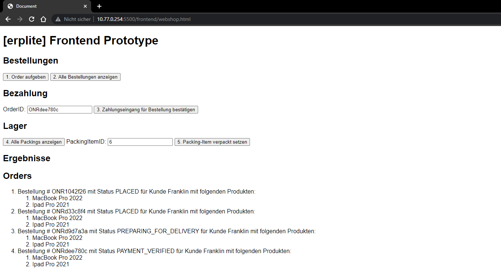

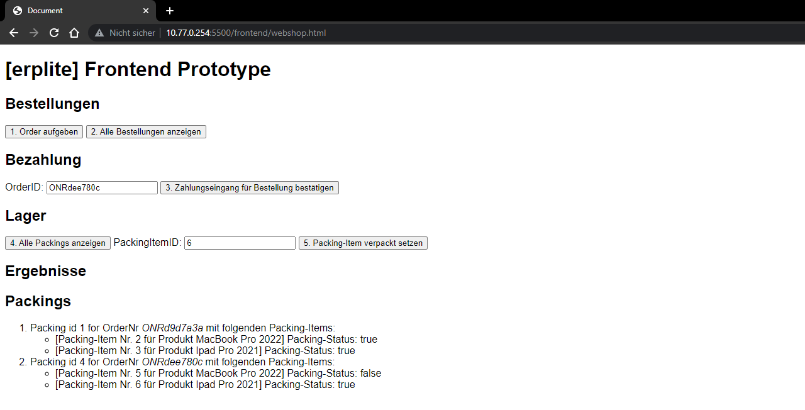

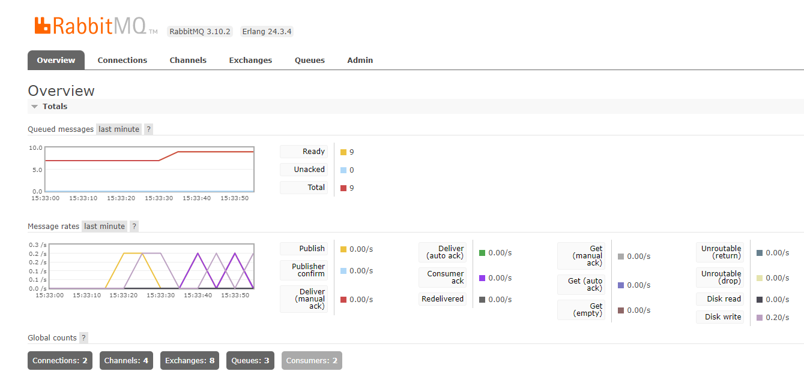

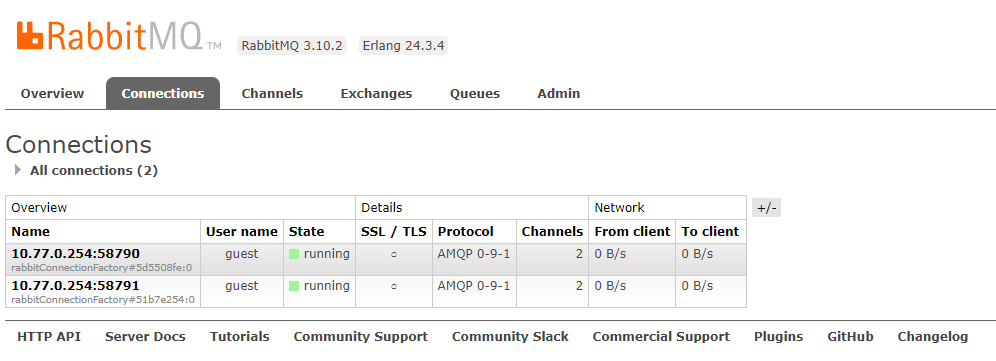

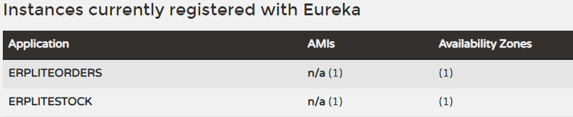

### Fazit

Mit Flexibilität kommt aber auch Komplexibilität (verteiltes System/vertreilte Transaktionen) - je flexibler die Gestaltung wird desto vielschichtiger wird die Applikation.

Auch in diesem Beispiel könnten noch weitere Strukture aufgelöst (Strangler Pattern) werden
 - zB verwenden eines Out-Box-Patterns
   - zB Transaktion in Datenbank schreiben und Nachricht über MessageBroker schicken aufteilen (mittels Polling Mechanismus)
     - zB Transaktion löst zwei Befehle aus: die Transaction selbst und ein Datensatz der in eine Out-Box Tabelle in der selben Datenbank geschrieben wird - Polling ließt zB alle paar Sekunden ob/was sich geändert hat und löst dann die Message aus

*Strangler Pattern*: Monolithen immer weiter auftrennen, bis ein Microservice entsteht - der Monolith sollte möglichst modular - ein Modulith - sein (erster Schritt ist immer die Modularität)

Warum dann das Ganze?
 - Wiederverwendbarkeit der Services
 - Aber auch vor allem Unabhägigkeit
 &rarr; während Team 1 an Service A weiterentwickelt, muss an Service B überhaupt nicht angefasst werden muss